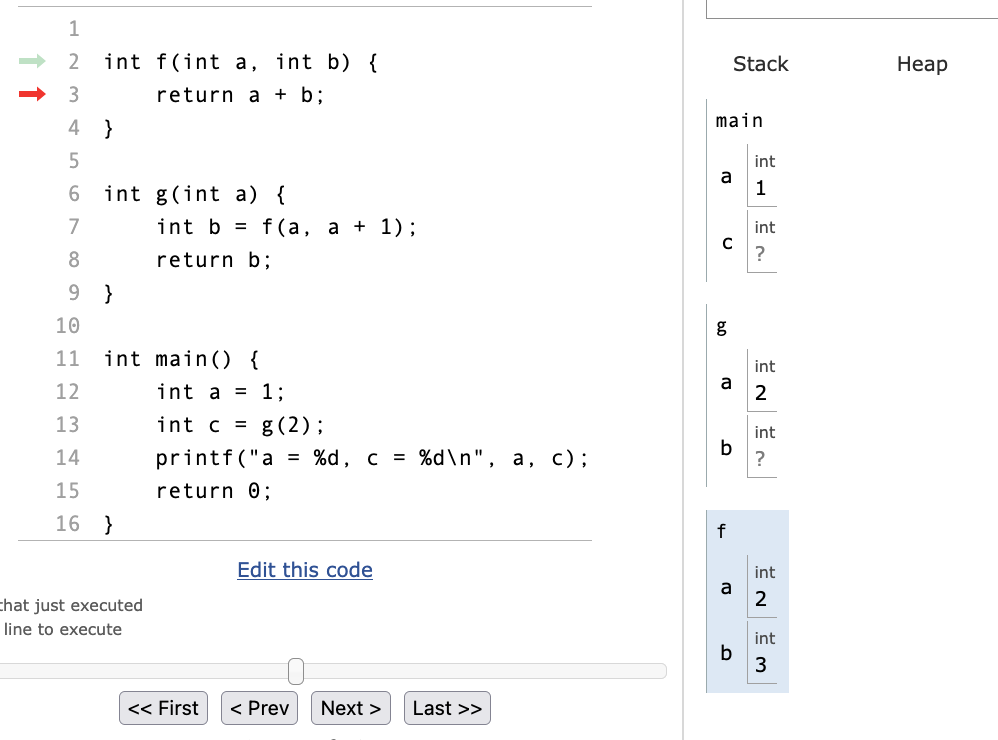

# TP2 : Piles, files

Dans le TP nous avons spécialisé le type liste dynamique en implémentant les structures de piles et de files, permettant **moins** d'opérations. Limiter le nombre d'opérations disponibles nous permet de simplifier l'objet conceptuel utilisé par nos algorithmes, et ainsi simplifier leur écriture. Dans les piles et les files, nous n'avons plus d'indices à considérer, mais simplement le *sommet* de la pile ou l'*avant* et l'*arrière* de la file.

# I - Structure de pile

## 1) Définition

Une *pile* (*stack* en anglais) est un type abstrait de structure de données linéaire de type *Last In, First Out*, ou *LIFO*, c'est-à-dire qu'on accède à ses éléments par ordre inverse de l'ordre d'ajout.

Une pile permet les trois opérations suivantes :

* Déterminer si la pile est vide
* *Empiler* un élément : l'ajouter à la pile, à l'avant. On appelle souvent cette opération *push*.
* *Dépiler* un élément : obtenir le dernier élément à avoir été ajouté (celui à l'avant), et le retirer de la structure. On appelle souvent cette opération *pop*.

```{mermaid}
%%| fig-align: center
%%| label: fig-stack
%%| fig-cap: Opérations d'empilement et de dépilement
block-beta

    columns 27
    
    space:4     pushed["3"]:3 space pushed2["4"]:3 space:5 popped["4"]:3 space pushed3["5"]:3 space:4
    space:27
    space:27

    space:12                                        D4["4"]:3 space:9                               G4["5"]:3 space:4
    space:4                         C3["3"]:3 space D3["3"]:3 space E3["3"]:3 space F3["3"]:3 space G3["3"]:3    
    A2["2"]:3 space B2["2"]:3 space C2["2"]:3 space D2["2"]:3 space E2["2"]:3 space F2["2"]:3 space G2["2"]:3
    A1["1"]:3 space B1["1"]:3 space C1["1"]:3 space D1["1"]:3 space E1["1"]:3 space F1["1"]:3 space G1["1"]:3

    pushed -- "push" --> B2
    pushed2 -- "push" --> C3
    E3 -- "pop" --> popped
    pushed3 -- "push" --> F3

    style pushed  fill:#bbf,color:#000
    style pushed2 fill:#bbf,color:#000
    style pushed3 fill:#bbf,color:#000
    style popped  fill:#bbf,color:#000
```

Ce type abstrait est restreint à ces trois opérations uniquement, car elles sont suffisantes dans de nombreuses utilisations.

## 2) Applications

On peut trouver des piles dans de nombreuses applications.

### Annulation d'une action: Ctrl-Z

Dans un éditeur de texte, les opérations successives sur le fichier sont placées dans une pile. Appelons cette pile $Stack_{ops}$. En appuyant sur Ctrl + Z (*undo*) on dépile les opérations une à une. Les opérations dépilées ne sont pas supprimées, car on peut vouloir les rétablir avec Ctrl + Y (*redo*). On empile alors les opérations annulées dans une deuxième pile, $Stack_{undone}$. Ces opérations seront elles-mêmes dépilées à chaque rétablissement, et réempilées sur $Stack_{ops}$.
Lorsque l'on annule plusieurs opérations $op_1$, $op_2$, ..., $op_k$ et qu'on applique une nouvelle opération $new\_op$, les opérations $op_1$, $op_2$, ..., $op_k$ empilées sur $Stack_{undone}$ sont supprimées : on vide $Stack_{undone}$ et on empile $new\_op$ sur $Stack_{ops}$.


| Opération   | Texte       | Stack_ops   | Stack_undone |
| ----------- | ----------- | ----------- | ----------- |
| ``'A'``               | ``A``           | ``[ 'A' ]``                     | ``[ ]``                   |
| ``'B'``               | ``AB``          | ``[ 'B', 'A' ]``                | ``[ ]``                   |
| ``'C'``               | ``ABC``         | ``[ 'C', 'B', 'A' ]``           | ``[ ]``                   |
| **Ctrl + Z** (undo)   | ``AB``          | ``[ 'B', 'A' ]``                | ``[ 'C' ]``               |
| **Ctrl + Z** (undo)   | ``A``           | ``[ 'A' ]``                     | ``[ 'B', 'C' ]``          |
| **Ctrl + Y** (redo)   | ``AB``          | ``[ 'B', 'A' ]``                | ``[ 'C' ]``               |
| ``'D'``               | ``ABD``         | ``[ 'D', 'B', 'A' ]``           | ``[ ]``                   |

De même, dans un navigateur web, les options "Page précédente" et "Page suivante" sont implémentées de la même manière, avec deux piles : $Stack_{visited}$ stockant les dernières pages visitées, et $Stack_{backtracked}$ sur laquelle on empile la page actuelle lorsque l'on clique sur "Page précédente". Si l'on clique plusieurs fois sur "Page précédente" puis sur un lien, la pile $Stack_{backtracked}$ est vidée, et l'on recommence à empiler les pages sur $Stack_{visited}$.


### Evaluation d'expression en notation polonaise inversée (postfixée)

Une expression arithmétique est dite notée en *notation polonaise inversée*, ou *notation postfixée*, si les opérateurs sont situés immédiatement après les opérandes. Par exemple, dans l'expression suivante :
```
1 2 + 3 *
```
L'opération d'addition est appliquée à 1 et 2, avant que le résultat ne soit utilisé par l'opérateur * pour appliquer l'opération 3 * 3. L'expression s'évalue donc à 9, elle est équivalente à 

```
(1 + 2) * 3
```
(en *notation infixe*, la notation usuelle).

L'objet de la partie 1 du TP2 est d'implémenter un évaluateur d'expressions en notation polonaise inversée, à l'aide d'une pile. On parcourt l'expression élément par élément.

- Lorsque le premier élément (*token*) de l'expression est un nombre, l'empiler sur la pile.
- Lorsque le premier élément de l'expression est un opérateur ``op``, dépiler deux éléments de la pile.
    - S'il ne s'agit pas de deux nombres, l'expression est mal formée. Renvoyer une erreur.
    - Sinon, pour les deux nombres ``b`` et ``a``, appliquer l'opération ``a op b`` pour obtenir le résultat ``c``. Empiler ``c``sur la pile.
- Une fois l'expression entièrement parcourue, la pile doit contenir exactement un élément, qui est un nombre. C'est le résultat de l'évaluation de la formule.

**Exemple** :

La formule est ``3 4 5 + * 2 -``.

| Élément de l'expression     | Action | État de la pile |
| ----------- | ----------- | ----------- |
| ``3``      |  Empiler ``3``      |  ``[ 3 ]``  |
| ``4``      |  Empiler ``4``      |  ``[ 4, 3 ]``  |
| ``5``      |  Empiler ``5``      |  ``[ 5, 4, 3 ]``  |
| ``+``      |  Dépiler ``5`` puis ``4``, empiler ``4 + 5 = 9``      |  ``[ 9, 3 ]``  |
| ``*``      |  Dépiler ``9``puis ``3``, empiler ``3 * 9 = 27``      |  ``[ 27 ]``  |
| ``2``      |  Empiler ``2``      |  ``[ 2, 27 ]``  |
| ``-``      |  Dépiler ``2`` puis ``27``, empiler ``27 - 2 = 25``      |  ``[ 25 ]``  |

La pile ne contient qu'un seul élément, ``25``, c'est donc le résultat de l'évaluation.

L'expression est donc équivalente à ``(3 * (4 + 5)) - 2``, mais a l'avantage de **ne pas nécessiter de parenthèses**.

En outre, les expression en forme infixe nécessitent de tenir compte de l'ordre de précédence des opérateurs : ``3 + 2 * 5`` s'évalue à ``3 + (2 * 5)`` à cause de la priorité de ``*`` sur ``+``. L'évaluation de formules en notation polonaise inversée permet de ne pas avoir à tenir compte de la précédence des opérateurs.

### Pile d'appel lors de l'exécution d'un programme

Lors de l'exécution d'un programme, la machine dispose d'une *pile d'appel* pour stocker les informations utiles lorsqu'elle doit procéder à un appel de fonction.

Par exemple, pour le code suivant :

```C
int f(int a, int b) {
    return a + b;
}

int g(int a) {
    int b = f(a, a + 1);
    return b;
}

int main() {
    int a = 1;
    int c = g(2);
    printf("a = %d, c = %d\n", a, c);
    return 0;
}
```

Le processeur va dans un premier temps exécuter la fonction ``main``, en stockant sur la *pile* (*stack*) ses variables locales.

```{mermaid}
stateDiagram
    Main : (main) a = 1, c = ?
```

Lorsqu'il rencontre un appel à la fonction ``g``, il met en pause son exécution, et exécute la fonction ``g`` pour calculer la valeur à mettre dans ``c``. Il copie donc la valeur ``2`` dans la variable locale ``a`` de ``g``, qu'il place dans une nouvelle entrée de la pile.

```{mermaid}
stateDiagram
    Main: (main) a = 1, c = ?
    G: (g) a = 2, b = ?
    Main --> G
```

La fonction doit alors effectuer un appel à ``f``, le processeur crée une nouvelle entrée dans la pile, en copiant les valeurs de ``a`` et ``a + 1`` dans les variables locales ``a`` et ``b`` de ``f``.

```{mermaid}
stateDiagram
    Main : (main) a = 1, c = ?
    G : (g) a = 2, b = ?
    F : (f) a = 2, b = 3
    Main --> G
    G --> F
```

La fonction ``f`` renvoie ``a + b = 5``. Le processeur peut alors dépiler l'entrée ``f`` de la pile, et donner la valeur ``5`` à ``b``.

```{mermaid}
stateDiagram
    Main : (main) a = 1, c = ?
    G : (g) a = 2, b = 5
    Main --> G
```

La fonction ``g`` renvoie la valeur de ``b``, donc ``5``. Le processeur dépile l'entrée ``g`` de la pile et place la valeur ``5`` dans ``c``.

```{mermaid}
stateDiagram
    Main : (main) a = 1, c = 5
```

La fonction ``printf`` affiche :
```
a = 1, c = 5
```

La valeur de la variable locale a bien été sauvegardée durant les appels aux fonctions ``g`` et ``f``.

Une telle pile d'appel est utilisée dans la plupart des langages de programmation, mais elle est particulièrement présente dans le langage C, du fait de son positionnement de langage de programmation de bas-niveau, c'est-à-dire proche de la machine.

On peut visualiser la pile d'appel et le tas avec CTutor : 


[Lien vers le programme dans CTutor](https://pythontutor.com/visualize.html#code=%0Aint%20f%28int%20a,%20int%20b%29%20%7B%0A%20%20%20%20return%20a%20%2B%20b%3B%0A%7D%0A%0Aint%20g%28int%20a%29%20%7B%0A%20%20%20%20int%20b%20%3D%20f%28a,%20a%20%2B%201%29%3B%0A%20%20%20%20return%20b%3B%0A%7D%0A%0Aint%20main%28%29%20%7B%0A%20%20%20%20int%20a%20%3D%201%3B%0A%20%20%20%20int%20c%20%3D%20g%282%29%3B%0A%20%20%20%20printf%28%22a%20%3D%20%25d,%20c%20%3D%20%25d%5Cn%22,%20a,%20c%29%3B%0A%20%20%20%20return%200%3B%0A%7D&cumulative=false&heapPrimitives=nevernest&mode=edit&origin=opt-frontend.js&py=c_gcc9.3.0&rawInputLstJSON=%5B%5D&textReferences=false)

## 3) Implémentation

Il existe plusieurs manières d'implémenter une pile, dépendant des propriétés recherchées. Nous pouvons réutiliser la structure de liste dynamique implémentée au TP1, afin d'implémenter nos opérations de pile.

```C
// stack.h

#include "list_linked.c" // Implémentation par listes chaînées

typedef struct {
    t_list list;
} t_stack;


// stack.c
 
t_stack create_empty_stack() {
    t_stack stack;
    stack.list = create_empty_list();
    return stack;
}

// Returns true if the stack is empty
bool is_empty_stack(t_stack *stack) {
    return length(&stack->list) == 0;
}

// Pushes the value val to the top of the stack
void push(t_stack *stack, T val) {
    push_front(&stack->list, val);
}

// Returns the value at the top of the stack
T get_top(t_stack *stack) {
    return get(&stack->list, 0);
}

// Returns the value at the top of the stack and deletes it from the stack
T pop(t_stack *stack) {
    T t = get_top(stack);
    delete_at(&stack->list, 0);
    return t;
}
```

La structure de liste chaînée (à une seule extrêmité) est pertinente pour implémenter une pile : les opérations ``push_front(list, val)`` d'ajout en tête, ``get(list, 0)`` d'accès en tête, et ``delete_at(list, 0)`` de suppression en tête ont toutes une complexité constante $O(1)$.

On a ici procédé à une **encapsulation** : on a caché l'implémentation d'une structure derrière une **interface** que l'on a mise à disposition de l'utilisateur. L'utilisateur de notre bibliothèque devra nécessairement passer par nos fonctions s'il souhaite accéder à la structure ou la modifier. Cela a le double avantage :

- pour l'utilisateur de ne pas se soucier des détails d'implémentation de la structure qu'il utilise.
- pour le développeur de la structure de garantir que l'utilisateur ne modifiera pas lui-même les variables de la structure de manière imprévisible.

Nous avons également pu réutiliser du code existant, en **spécialisant** la structure de liste dynamique pour notre usage. L'implémentation d'une structure aussi générale que ``t_list`` dans le TP1 nous permet à présent d'implémenter une pile très facilement, en appelant des fonctions existantes avec les bons paramètres.


# II - Structure de file

## 1) Définition

Une *file* (en anglais *queue*) est un type abstrait de structure de données linéaire, de type *First In, First Out*, ou *FIFO*, c'est-à-dire qu'on accède à ses éléments par ordre d'ajout, à la manière d'une file d'attente (premier arrivé, premier servi).

Une file permet les trois opérations suivantes :

* Déterminer si la file est vide
* *Enfiler* un élément : l'ajouter à la file, à l'arrière. On appelle souvent cette opération *push* ou *enqueue*.
* *Défiler* un élément : obtenir l'élément à l'avant de la file (le plus ancien encore présent par ordre d'ajout), et le retirer de la structure. On appelle souvent cette opération *pop* ou *dequeue*.

```{mermaid}
%%| fig-align: center
%%| label: fig-queue
%%| fig-cap: Opérations d'enfilement et de défilement

block-beta

    columns 27
    
    space:4     pushed["3"]:3 space pushed2["4"]:3 space:9 pushed3["5"]:3 space:4
    space:27
    space:27

    space:12                                        D4["4"]:3 space E4["4"]:3 space:5                   G4["5"]:3 space:4
    space:4                         C3["3"]:3 space D3["3"]:3 space E3["3"]:3 space     F3["4"]:3 space G3["4"]:3    
    A2["2"]:3 space B2["2"]:3 space C2["2"]:3 space D2["2"]:3 space E2["2"]:3 space     F2["3"]:3 space G2["3"]:3
    A1["1"]:3 space B1["1"]:3 space C1["1"]:3 space D1["1"]:3 space:5                   F1["2"]:3 space G1["2"]:3

    space:27
    space:27

    space:16 popped["1"]:3 space:8

    pushed -- "enqueue" --> B2
    pushed2 -- "enqueue" --> C3
    E2 -- "dequeue" --> popped
    pushed3 -- "enqueue" --> F3

    style A1      fill:#feb,color:#000
    style A2      fill:#feb,color:#000
    style B1      fill:#feb,color:#000
    style B2      fill:#feb,color:#000
    style C1      fill:#feb,color:#000
    style C2      fill:#feb,color:#000
    style C3      fill:#feb,color:#000
    style D1      fill:#feb,color:#000
    style D2      fill:#feb,color:#000
    style D3      fill:#feb,color:#000
    style D4      fill:#feb,color:#000
    style E2      fill:#feb,color:#000
    style E3      fill:#feb,color:#000
    style E4      fill:#feb,color:#000
    style F1      fill:#feb,color:#000
    style F2      fill:#feb,color:#000
    style F3      fill:#feb,color:#000
    style G1      fill:#feb,color:#000
    style G2      fill:#feb,color:#000
    style G3      fill:#feb,color:#000
    style G4      fill:#feb,color:#000
    style pushed  fill:#fb8,color:#000
    style pushed2 fill:#fb8,color:#000
    style pushed3 fill:#fb8,color:#000
    style popped  fill:#fb8,color:#000
```

## 2) Applications

Comme les piles, les files sont utilisées dans de nombreuses applications.

### Mise en attente d'objets par ordre d'arrivée

Comme dans le cas d'une file d'attente de personnes, de nombreuses applications informatiques nécessitent de mettre en attente des objets par ordre d'arrivée. Par exemple dans une situation où des utilisateurs doivent se connecter à un serveur saturé, et doivent attendre des déconnexions d'utilisateurs pour être connectés au serveur. Les utilisateurs sont placés dans une file et traités par ordre d'arrivée.

### Ordonnancement des processus par le système d'exploitation

Le système d'exploitation de la machine s'occupe de gérer les différents processus qui s'exécutent par alternance. Pour ce faire, il place les processus dans plusieurs files d'attentes :

- **Job queue** : les processus sont initialement placées dans la file des tâches à réaliser, en attente d'exécution.
- **Ready queue** : les processus prêts à être exécutés sont ensuite acheminés vers la Ready queue, et attendent que le processeur soit disponible.
- L'ordonnanceur sélectionne ensuite les processus dans la Ready queue et les donne au CPU afin qu'il les exécute.

En pratique, on utilisera plutôt une structure de *file de priorité*, où les éléments sont classés selon un niveau de priorité et défilés dans cet ordre. Il existe des méthodes efficaces pour implémenter les files de priorités, comme les *tas binaires*, un cas particulier d'*arbre binaire* (voir le cours 4).

### File d'attente de message

Pour la communication entre processus ou de serveur à serveur, on utilise des *files d'attente de message*, pour mettre les messages en attente et les traiter par ordre d'envoi.

[https://fr.wikipedia.org/wiki/File_d'attente_de_message](https://fr.wikipedia.org/wiki/File_d'attente_de_message)


### Parcours en largeur et parcours en profondeur

Supposons que l'on souhaite parcourir un *arbre* abstrait comme celui-ci.

```{mermaid}
stateDiagram
    A1 : 1
    A2 : 2
    A3 : 3
    A4 : 4
    A5 : 5
    A6 : 6
    A7 : 7
    A8 : 8
    A9 : 9
    A10 : 10
    A11 : 11
    A12 : 12
    A13 : 13
    A14 : 14
    A15 : 15
    A16 : 16
    A17 : 17
    A18 : 18
    A19 : 19
    A20 : 20

    A1 --> A2
    A1 --> A3
    A1 --> A4
    A1 --> A5
    A2 --> A6
    A2 --> A7
    A2 --> A8
    A3 --> A9
    A3 --> A10
    A4 --> A11
    A5 --> A12
    A5 --> A13
    A5 --> A14
    A6 --> A15
    A6 --> A16
    A7 --> A17
    A8 --> A18
    A9 --> A19
    A9 --> A20
```

On part du sommet ``1``, et on place ses voisins dans une file. Ensuite, on défile le premier élément de la file, et on enfile ses voisins. On répète le processus jusqu'à ce qu'il n'y ait plus de sommets à explorer

- Après la première étape, la file contient les sommets ``[ 2, 3, 4, 5 ]`` dans cet ordre.
- On défile le sommet ``2``, on place ses voisins dans la file : la file contient ``[ 3, 4, 5, 6, 7, 8 ]``.
- On défile le sommet ``3``, on place ses voisins dans la file : la file contient ``[ 4, 5, 6, 7, 8, 9, 10 ]``.

Ce type de parcours de l'arbre est appelé **parcours en largeur** (*breadth-first search*, *BFS*) : on parcourt les voisins d'un sommet, puis les voisins des voisins, puis leurs voisins, et ainsi de suite.

Si l'on remplace la file par une pile, le parcours est différent.

- Après la première étape, la pile contient les sommets ``[ 5, 4, 3, 2 ]`` dans cet ordre.
- On dépile le sommet ``5``, on place ses voisins dans la pile : la pile contient ``[ 14, 13, 12, 5, 4, 3, 2 ]``.
- On dépile le sommet ``14``, on place ses voisins dans la pile : la pile contient ``[ 29, 28, 13, 12, 5, 4, 3, 2]``.

Ce type de parcours est appelé **parcours en profondeur** (*depth-first search*, *DFS*) : on avance dans une branche en prenant le premier voisin, puis le premier voisin de ce sommet, et ainsi de suite, jusqu'à être bloqué. Ensuite, on recule d'une position (*backtrack*), et on emprunte cette fois la voie du deuxième voisin de ce sommet. On répète le processus jusqu'à ce qu'il n'y ait plus de sommets disponibles.

```{mermaid}
%%| fig-align: center
%%| label: fig-dfs
%%| fig-cap: Ordre de parcours des sommets lors d'un parcours en profondeur (en rouge)
stateDiagram
    A1 : 1 <FONT color=red>1</FONT>
    A2 : 2 <FONT color=red>13</FONT>
    A3 : 3 <FONT color=red>8</FONT>
    A4 : 4 <FONT color=red>6</FONT>
    A5 : 5 <FONT color=red>2</FONT>
    A6 : 6 <FONT color=red>18</FONT>
    A7 : 7 <FONT color=red>16</FONT>
    A8 : 8 <FONT color=red>14</FONT>
    A9 : 9 <FONT color=red>10</FONT>
    A10 : 10 <FONT color=red>9</FONT>
    A11 : 11 <FONT color=red>7</FONT>
    A12 : 12 <FONT color=red>5</FONT>
    A13 : 13 <FONT color=red>4</FONT>
    A14 : 14 <FONT color=red>3</FONT>
    A15 : 15 <FONT color=red>20</FONT>
    A16 : 16 <FONT color=red>19</FONT>
    A17 : 17 <FONT color=red>17</FONT>
    A18 : 18 <FONT color=red>15</FONT>
    A19 : 19 <FONT color=red>12</FONT>
    A20 : 20 <FONT color=red>11</FONT>

    A1 --> A2
    A1 --> A3
    A1 --> A4
    A1 --> A5
    A2 --> A6
    A2 --> A7
    A2 --> A8
    A3 --> A9
    A3 --> A10
    A4 --> A11
    A5 --> A12
    A5 --> A13
    A5 --> A14
    A6 --> A15
    A6 --> A16
    A7 --> A17
    A8 --> A18
    A9 --> A19
    A9 --> A20
```

Ces deux parcours s'appliquent plus généralement aux *graphes* : un graphe est un ensemble de noeuds (*sommets*, en anglais *vertex* / *vertices*) reliés par des liaisons (*arêtes*, en anglais *edges*) et pouvant contenir des cycles. Dans un parcours en largeur ou en profondeur, on veille à ne pas passer deux fois par le même sommet, en marquant les sommets déjà parcourus.

Le parcours en profondeur peut être utilisé dans le parcours de labyrinthe : on avance en suivant le mur de droite jusqu'à trouver la sortie. Il s'agit de la *méthode de la main droite*.

Le parcours en largeur est lui utilisé pour déterminer le plus court chemin d'un sommet vers tous les autres sommets d'un graphe.


## 3) Implémentation

A la différence des files, on doit ici considérer des **listes chaînées à deux extrêmités**, car celles-ci permettent des opérations d'ajout en dernière position et de retrait en première position en temps constant (les listes chaînées classiques nécessitent un temps linéaire pour ajouter en dernière position).

```C
// queue.h

#include "list_double-ended.h" // Implémentation par liste à deux extrêmités

typedef struct {
    t_list list;
} t_queue;


// queue.c

t_queue create_empty_queue() {
    t_queue queue;
    queue.list = create_empty_list();
    return queue;
}

// Returns true if the queue is empty
bool is_empty_queue(t_queue *queue) {
    return length(&queue->list) == 0;
}

// Pushes the value val to the back of the queue
void push_queue(t_queue *queue, T val) {
    push_back(&queue->list, val);
}

// Returns the value at the front of the queue
T get_front_queue(t_queue *queue) {
    return get(&queue->list, 0);
}

// Returns the value at the front of the queue and deletes it from the queue
T pop_queue(t_queue *queue) {
    T t = get_front_queue(queue);
    delete_at(&queue->list, 0);
    return t;
}
```
