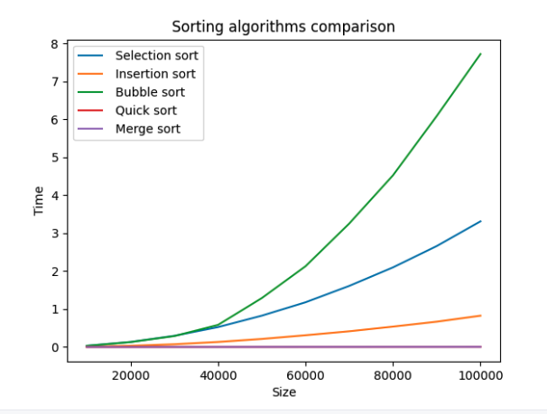
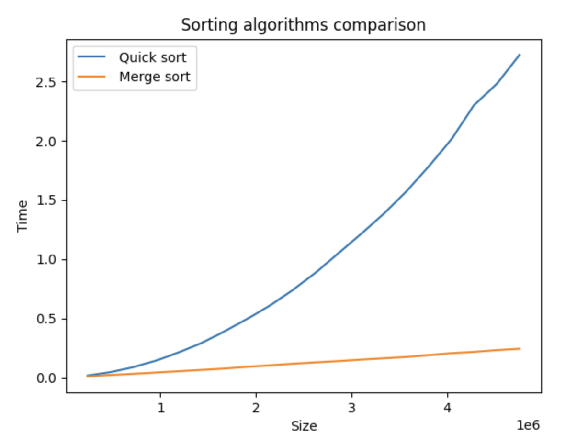
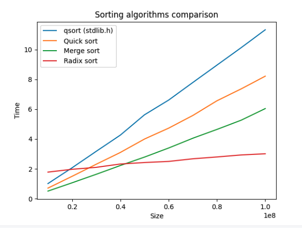

# La fonction ``qsort``

Les algorithmes de tri permettent de trier un ensemble de données selon un critère. On définit souvent ces algorithmes sur des entiers que l'on trie par ordre croissant, mais on peut trier tout type de données, à condition de fournir la fonction de comparaison adéquate.

Par exemple, la bibliothèque standard du langage C propose déjà une fonction de tri appelée ``qsort``, qui trie selon un critère défini par une fonction à fournir. Il faut pour cela écrire l'instruction suivante au début du programme :
```C
#include <stdlib.h>
```

Munissons-nous d'un type arbitraire, par exemple une ``struct`` contenant deux champs ``a``, ``b`` entiers.

```C
typedef struct {
    int a;
    int b;
} t_pair;
```

Dans la fonction ``main``, on dispose du tableau ``t`` et on suppose que l'on dispose également d'une fonction d'affichage de ce tableau :
```C
int main() {
    t_pair t[] = { {3,2}, {7,6}, {4,1}, {5,0}, {6,9}, {4, 8} };
    int nb_elts = 6;
    print_pair_array(t, nb_elts);
    return 0;
}
// affiche:
// (3, 2) (7, 6) (4, 1) (5, 0) (6, 9) (4, 8)
```

On souhaite trier ces données selon le critère suivant : les couples ayant leur champ ``a`` pair en premier, dans un ordre quelconque, suivis des couples ayant leur champ ``a`` impair triés par ordre croissant de ``b``.

Nous allons utiliser la fonction ``qsort``, qui demande en argument une fonction de comparaison de deux éléments quelconques.
Le prototype de ``qsort`` est le suivant :
```C
void qsort(void * array, size_t elementCount, size_t elementSize,
            int (*compareFunction)(const void*, const void*));
```

- ``array`` est le tableau à trier. Pour que ``qsort`` puisse trier des tableaux de tous types, le tableau est donné sous la forme d'un pointeur ``void *``, c'est-à-dire un pointeur vers une plage mémoire de type inconnu.
- ``elementCount`` est le nombre d'éléments du tableau.
- ``elementSize`` est la taille en octets d'un élément du tableau, ici ``sizeof(t_pair)``.
- ``compareFunction`` est un **pointeur de fonction** : un pointeur qui contient l'adresse d'une fonction. Cette fonction doit prendre en entrée deux pointeurs ``void *`` (afin que ``qsort`` puisse s'appliquer à des données de n'importe quel type) et renvoie un ``int``, qui sera une valeur strictement négatif si le premier argument est strictement inférieur au second, strictement positif s'il est strictement supérieur, et ``0`` s'ils sont égaux.

On écrit donc la fonction suivante :

```C
int comp_pair(const void *elt_1, const void *elt_2) {
    const t_pair *p1 = (t_pair *) elt_1;
    const t_pair *p2 = (t_pair *) elt_2;
    if (p1->a % 2 == 0)
        return -1;
    if (p2->a % 2 == 0)
        return 1;
    return p1->b - p2->b;
}
```

On commence par *caster* nos pointeurs ``elt_1`` et ``elt_2`` en pointeurs ``t_pair *``. Le mot-clé ``const`` signifie que la donnée pointée ne sera pas modifiée.

On appelle la fonction dans ``main`` et on affiche le résultat :

```C
int main() {
    t_pair t[] = { {3,2}, {7,6}, {4,1}, {5,0}, {6,9}, {4, 8} };
    int nb_elts = 6;
    print_pair_array(t, nb_elts);
    qsort(t, nb_elts, sizeof(t_pair), &comp_pair); // <- adresse de comp_pair
    print_pair_array(t, nb_elts);
    return 0;
}
// Affiche :
// (3, 2) (7, 6) (4, 1) (5, 0) (6, 9) (4, 8) 
// (4, 1) (6, 9) (4, 8) (5, 0) (3, 2) (7, 6) 
```

On observe que les couples ayant leur champ ``a`` pair sont bien en premières position, dans un ordre quelconque. Les autres couples sont triés par ordre croissant selon le champ ``b``.

On peut donc utiliser la fonction ``qsort`` pour trier des données de n'importe quel type. Pour trier des éléments entiers par ordre croissant, il suffit de fournir la fonction de comparaison suivante :

```C
int comp_int(const void *elt_1, const void *elt_2) {
    return *(int *) elt_1 - *(int *) elt_2;
}

int main() {
    int t[] = { 3, 1, 5, 2, 4, 8, 1, 9 };
    int n = 8;
    qsort(t, n, sizeof(int), &comp_int);
    for (int i = 0; i < n; i++)
        printf("%d ", t[i]);
}
// Affiche :
// 1 1 2 3 4 5 8 9
```

L'algorithme utilisé par ``qsort`` est un mélange de Quicksort et de tri par insertion.

# Algorithmes de tri

Nous allons à présent voir le détail de plusieurs algorithmes de tri classiques. On considèrera des tableaux de type ``T`` défini ici par :
```C
typedef int T;
```

## Les algorithmes quadratiques

### 1) Tri par sélection

#### Principe

On note $n$ le nombre d'éléments de la liste.  

- Pour $i$ de $0$ à $n - 1$ :  
    - Trouver l'indice $i_{min}$ du plus petit élément de la liste parmi les éléments d'indices $\geq i$.
    - Echanger les éléments d'indices $i_{min}$ et $i$.

```{mermaid}
%%| fig-align: center
%%| label: fig-trisel
%%| fig-cap: Tri par sélection
block-beta
    columns 10

    A1["4"]:2
    A2["3"]:2
    A3["5"]:2
    A4["1"]:2
    A5["2"]:2
    
    space:10
    
    B1["4"]:2
    B2["3"]:2
    B3["5"]:2
    B4["1"]:2
    B5["2"]:2
    
    space:10
    style B4 fill:#DAC,stroke:#333,stroke-width:2px
    
    C1["1"]:2
    C2["3"]:2
    C3["5"]:2
    C4["4"]:2
    C5["2"]:2
    
    space:10
    B4 --> C1
    B1 --> C4
    style C1 fill:#FFF
    style C5 fill:#DAC,stroke:#333,stroke-width:2px

    D1["1"]:2
    D2["2"]:2
    D3["5"]:2
    D4["4"]:2
    D5["3"]:2

    C5 --> D2
    C2 --> D5
    style D1 fill:#FFF
    style D2 fill:#FFF
    space:10
    
    E1["1"]:2
    E2["2"]:2
    E3["3"]:2
    E4["4"]:2
    E5["5"]:2
    D3 --> E5
    D5 --> E3
    style D5 fill:#DAC,stroke:#333,stroke-width:2px
    style E1 fill:#FFF
    style E2 fill:#FFF
    style E3 fill:#FFF

    style E4 fill:#DAC,stroke:#333,stroke-width:2px
    space:10
    F1["1"]:2
    F2["2"]:2
    F3["3"]:2
    F4["4"]:2
    F5["5"]:2
    E4 --> F4
    
    style F1 fill:#FFF
    style F2 fill:#FFF
    style F3 fill:#FFF
    style F4 fill:#FFF
    style F5 fill:#FFF
```

Ou de manière équivalente :

- Si la liste est de longueur $n \geq 2$ :
    - Trouver le plus petit élément de la liste, et l'extraire de la liste.
    - Ajouter cet élément en première position de la liste.
    - Réitérer l'algorithme en ne considérant que les éléments à l'exception du premier.

#### Implémentation

On peut implémenter cet algorithme de manière itérative :

```C
unsigned int find_min_index(T t[], unsigned int size, unsigned int index_start) {
    unsigned int index_min = index_start;
    for (unsigned int i = index_start + 1; i < size; i++) {
        if (t[i] < t[index_min]) {
            index_min = i;
        }
    }
    return index_min;
}

void swap(T t[], unsigned int i, unsigned int j) {
    T temp = t[i];
    t[i] = t[j];
    t[j] = temp;
}

void selection_sort(T t[], unsigned int size) {
    for (unsigned int i = 0; i < size - 1; i++) {
        unsigned int index_min = find_min_index(t, size, i);
        if (index_min != i)
            swap(t, i, index_min);
    }
}
```
On peut également l'implémenter de manière récursive :

```C
void selection_sort_rec(T t[], unsigned int size) {
    // Si le tableau n'a qu'un seul élément, il est déjà trié
    if (size <= 1)
        return;
    // Sinon, on trouve le minimum et on l'échange avec l'élément d'indice 0
    const unsigned int index_min = find_min_index(t, size, 0);
    if (index_min != 0) {
        swap(t, 0, index_min);
    }
    // On répète le processus avec le reste du tableau
    selection_sort_rec(t + 1, size - 1);
}
```

Le pointeur ``t + 1`` correspond à un pointeur vers ``t[1]``, c'est-à-dire à un pointeur vers le reste du tableau (voir la partie [Arithmétique des pointeurs](ablanche.quarto.pub/alsi51-structures-de-donnees/rappels_C.html#arithmétique-des-pointeurs) des rappels de C).

#### Complexité

Calculons la complexité en temps de cet algorithme.

- La fonction ``find_min_index(t, size, index_start)`` parcourt ``size - 1 - index_start`` éléments du tableau. Il a donc une complexité linéaire en pire cas.

- La fonction ``swap(t, i, j)`` s'exécute en temps constant.

- Dans la fonction ``selection_sort(t, size)``, on effectue ``size - 1`` appels à ``find_min_index``, respectivement avec ``index_start`` $= 0, 1, \dots, size - 2$.

Notons $size = n$ et calculons la complexité totale.

\begin{array}{rcl}
C_{select}(n) & = & \displaystyle \sum_{i = 0}^{n - 2} (n - 1 - i)\\
 & = & \displaystyle\sum_{i = 1}^{n - 1} i\\
 & = & \displaystyle\frac{n(n - 1)}{2} \\
 & = & O(n^2) \\
\end{array}

On peut également calculer cette complexité en considérant la variante récursive :

\begin{array}{rcl}
C_{select}(n) & = & (n - 1) + C_{select}(n - 1) \\
 & = & (n - 1) + (n - 2) + C_{select}(n - 2) \\
 & = & \dots \\
 & = & (n - 1) + (n - 2) + \dots + 1 + C_{select}(1) \\
 & = & (n - 1) + (n - 2) + \dots + 1 + 0 \\
 & = & \displaystyle\sum_{i = 0}^{n-1} i \\
 & = & \displaystyle\frac{n(n-1)}{2} \\
 & = & O(n^2) \\
\end{array}


### 2) Tri par insertion

#### Principe

- On considère une liste $aux$, initialement vide, et que l'on veillera à garder toujours triée.  
- Pour chaque élément $x$ de $list$ :
    - extraire $x$ de $list$
    - insérer $x$ dans $aux$ de manière à ce qu'elle reste triée.
- $aux$ est la liste triée renvoyée.

On également implémenter cet algorithme *en place*, c'est-à-dire dans un seul tableau, sans allouer de mémoire supplémentaire. Pour cela, on pourra utiliser les $i$ premières cases du tableau pour représenter $aux$, et les $n - i$ dernières cases pour la partie restante de $list$.

```{mermaid}
%%| fig-align: center
%%| label: fig-triinsert
%%| fig-cap: Tri par insertion
block-beta
    columns 11

    A1["4"]:2
    A2["3"]:2
    A3["5"]:2
    A4["1"]:2
    A5["2"]:2
    
    space:1
    space:11
    
    B1["4"]:2
    space:1
    B2["3"]:2
    B3["5"]:2
    B4["1"]:2
    B5["2"]:2

    A1 --> B1
    
    space:11
    style A1 fill:#DAC,stroke:#333,stroke-width:2px
    style B1 fill:#CFC
    
    C1["3"]:2
    C2["4"]:2
    space:1
    C3["5"]:2
    C4["1"]:2
    C5["2"]:2

    style B2 fill:#DAC,stroke:#333,stroke-width:2px
    B2 --> C1
    
    space:11
    
    style C1 fill:#CFC
    style C2 fill:#FFF

    D1["3"]:2
    D2["4"]:2
    D3["5"]:2
    space:1
    D4["1"]:2
    D5["2"]:2

    style C3 fill:#DAC,stroke:#333,stroke-width:2px
    C3 --> D3

    style D1 fill:#FFF
    style D2 fill:#FFF
    style D3 fill:#CFC
    space:11
    
    E1["1"]:2
    E2["3"]:2
    E3["4"]:2
    E4["5"]:2
    space:1
    E5["2"]:2

    style D4 fill:#DAC,stroke:#333,stroke-width:2px
    D4 --> E1
    
    style E1 fill:#CFC
    style E2 fill:#FFF
    style E3 fill:#FFF
    style E4 fill:#FFF

    space:11
    F1["1"]:2
    F2["2"]:2
    F3["3"]:2
    F4["4"]:2
    F5["5"]:2
    space:1

    style E5 fill:#DAC,stroke:#333,stroke-width:2px
    E5 --> F2
    
    style F1 fill:#FFF
    style F2 fill:#CFC
    style F3 fill:#FFF
    style F4 fill:#FFF
    style F5 fill:#FFF
```

#### Implémentation

On peut implémenter l'algorithme de manière itérative comme ceci :

```C
// Insère l'élément t[i0] dans le tableau t[0 ... i0 - 1]
void insert_sorted(T t[], unsigned int i0) {
    unsigned int i = i0; 
    const T t0 = t[i0]; // élément à insérer
    while (i > 0 && t[i - 1] > t0) {
        t[i] = t[i - 1]; // décalage de l'élément t[i - 1] vers la droite
        i--;
    }
    t[i] = t0; // insertion au bon endroit
    // (en position 0 ou i avec t[i] précédemment décalé à droite)
}

void insertion_sort(T t[], unsigned int size) {
    for (unsigned int i = 1; i < size; i++) {
        insert_sorted(t, i);
    }
}
```

#### Complexité

- La fonction ``insert_sorted(t, i)`` effectue au plus ``i0`` itérations.

- La fonction ``insertion_sort(t, size)`` effectue ``size - 1`` appels à la fonction ``insert_sorted``, avec ``i0`` successivement égal à $1, 2, \dots, size - 1$.

La complexité en pire cas de ``insertion_sort`` est donc $\displaystyle C_{insert}(n) = \sum_{i = 1}^{n-1} i = \frac{n(n-1)}{2} = O(n^2)$.


### 3) Tri à bulles

#### Principe

L'opération $bulle(i)$ est définie par :

- Pour $j$ de $0$ à $i$ :  
    - si $list[j] > list[j+1]$, échanger $list[j]$ et $list[j+1]$.

On note $n$ le nombre d'éléments de la liste.

L'algorithme du **tri à bulles** est le suivant :

- Pour $i$ décroissant de $n-2$ à $0$ :  
    - appliquer l'opération $bulle(i)$

Le nom de *bulle* vient du fait que les grands éléments de la liste vont progressivement monter jusqu'à la fin de la liste. En particulier, le maximum de la liste sera remonté jusqu'à la dernière position après la première application de l'opération $bulle$.

#### Implémentation

On peut implémenter l'algorithme avec deux boucles imbriquées, comme ceci :

```C
void bubble_sort(T t[], unsigned int size) {
    for (int i = size - 2; i >= 0; i--) {
        for (int j = 0; j <= i; j++) {
            if (t[j] > t[j + 1]) {
                swap(t, j, j + 1);
            }
        }
    }
}
```

On peut également décomposer cette fonction grâce à une fonction auxiliaire ``bubble`` :

```C
void bubble(T t[], int i) {
    for (int j = 0; j <= i; j++) {
        if (t[j] > t[j + 1]) {
            swap(t, j, j + 1);
        }
    }
}

void bubble_sort(T t[], unsigned int size) {
    for (int i = size - 2; i >= 0; i--) {
        bubble(t, i);
    }
}
```

#### Complexité

Le calcul de complexité est ici immédiat :

$$C_{bubble}(n) = \displaystyle \sum_{i = 0}^{n-2} (i + 1) = \displaystyle \sum_{i = 1}^{n-1} i = \displaystyle\frac{n(n-1)}{2} = O(n^2)$$

## Les algorithmes *Diviser pour régner*

Les algorithmes précédents étaient tous de complexité quadratique $O(n^2)$. La méthode *Diviser pour régner* (en anglais *Divide and conquer*) est une méthode algorithmique qui nous permet souvent d'atteindre de meilleures complexités.

La méthode consiste à résoudre un problème sur une entrée de taille $n$ en le **divisant** en plusieurs sous-problèmes, en résolvant le problème sur des entrées de taille strictement inférieures à $n$, puis en combinant les solutions.

Nous allons voir deux exemples d'algorithmes Diviser pour régner, le *tri rapide* et le *tri fusion*.

> La méthode Diviser pour régner est utilisée dans de nombreux d'algorithmes performants, comme la **multiplication rapide de grands nombres**, avec l'algorithme de Karatsuba, ou la **transformée de Fourier rapide** (FFT), inventée par le mathématicien Carl Friedrich Gauss en 1805.


Par exemple, si l'on peut résoudre notre problème sur une entrée de taille $n$ en combinant en temps $O(n)$ les solutions du problème sur deux entrées de taille $n / 2$, on peut calculer la complexité totale en sommant les coûts de tous les appels récursifs et de la combinaison des solutions :

```{mermaid}
%%| fig-align: center
stateDiagram
    A: n
    B0: n/2
    B1: n/2
    C0: n/4
    C1: n/4
    C2: n/4
    C3: n/4

    D0: n/8
    D1: n/8
    D2: n/8
    D3: n/8
    D4: n/8
    D5: n/8
    D6: n/8
    D7: n/8

    A --> B0
    A --> B1
    B0 --> C0
    B0 --> C1
    B1 --> C2
    B1 --> C3

    C0 --> D0
    C0 --> D1
    C1 --> D2
    C1 --> D3
    C2 --> D4
    C2 --> D5
    C3 --> D6
    C3 --> D7
```

$$\dots\ \ \ \ \ \ \ \ \ \ \ \ \ \ \ \ \ \ \ \ \ \ \ \ \ \ \ \ \ \ \ \ \ \ \ \ \ \ \ \ \ \ \ \ \ \ \ \ \dots\ \ \ \ \ \ \ \ \ \ \ \ \ \ \ \ \ \ \ \ \ \ \ \ \ \ \ \ \ \ \ \ \ \ \ \ \ \ \ \ \ \ \ \ \ \ \ \ \dots$$
```{mermaid}
%%| fig-align: center
stateDiagram
    Z0: 1
    Z1: 1
    Z2: 1
    Z3: 1
    Z4: 1
    Z5: 1
    Z6: 1
    Z7: 1

    Z10: 1
    Z11: 1
    Z12: 1
    Z13: 1
    Z14: 1
    Z15: 1
    Z16: 1
    Z17: 1
```

Les valeurs sur les noeuds indiquent les coûts des combinaisons de solutions. En divisant les sous-problèmes jusqu'à une taille atomique de $1$ (qui a un coût que l'on suppose égal à 1) et en sommant les coûts de l'arbre, on obtient un coût total de $n$ par ligne, et l'arbre contient $O(\log_2(n))$ lignes. On a donc un coût total (sous ces hypothèses) **quasilinéaire** en $O(n \log n)$.

### 4) Tri rapide (Quicksort)

#### Principe

L'algorithme du **tri rapide** est le suivant :

- On sélectionne un élément $p$ de la liste (par exemple $list[0]$), que l'on appelle le *pivot*, et on l'extrait de la liste.
- On sépare la liste en deux sous-listes $l_{inf}$ et $l_{sup}$, où $l_{inf}$ contient tous les éléments $list[i] \leq p$, et $l_{sup}$ contient tous les éléments $list[i] > p$.
- On applique récursivement l'algorithme du tri rapide sur $l_{inf}$ et $l_{sup}$. On suppose à présent qu'elles sont triées.
- La liste concaténée $l_{inf} + [p] + l_{sup}$ est la liste triée de sortie.

```{mermaid}
%%| fig-align: center
%%| label: fig-quick
%%| fig-cap: Tri rapide (Quicksort)
flowchart TD
    A["t"] --> Asplit(["split"])
    Asplit --> B["t_inf = { t[i] <= pivot }"]
    Asplit --> C["pivot"]
    Asplit --> D["t_sup = { t[i] > pivot }"]
    
    B --> Q1(["Quicksort"])
    D --> Q2(["Quicksort"])
    C ---> C2["pivot"]

    Q1 --> B2["sorted t_inf"]
    Q2 --> D2["sorted t_sup"]
    B2 --> A2["sorted t"]
    C2 --> A2
    D2 --> A2
     A:::ultra_wide_unsorted
     B:::wide_unsorted
     D:::wide_unsorted
     B2:::wide_sorted
     D2:::wide_sorted
     A2:::ultra_wide_sorted
    classDef wide_unsorted width:300px, display:flex, align-items:center, justify-content:center, fill:#FCC
    classDef wide_sorted width:300px, display:flex, align-items:center, justify-content:center, fill:#CFC
    classDef ultra_wide_unsorted width:650px, display:flex, align-items:center, justify-content:center, fill:#FCC
    classDef ultra_wide_sorted width:650px, display:flex, align-items:center, justify-content:center, fill:#CFC
    style Asplit fill:#BBDEFB
    style C fill:#CFC
    style Q1 fill:#FFE0B2
    style C2 fill:#CFC
    style Q2 fill:#FFE0B2
```

> L'algorithme du tri rapide a été inventé en 1960 par Tony Hoare (1934-), un chercheur britannique connu pour ses travaux fondateurs sur les langages de programmation, l'algorithmique, la vérification formelle (avec la *logique de Hoare*) et la programmation concurrente. Il a obtenu le Prix Turing en 1980 pour ses travaux sur les langages de programmation.

#### Implémentation

```C
// Sépare la section [i .. j] du tableau en deux sous-tableaux tinf and tsup, selon le pivot = t[i]
// Renvoie l'indice index_pivot du pivot après la séparation
// Après la séparation, tinf = t[i .. index_pivot - 1], tsup = t[index_pivot + 1 .. j]
unsigned int split(T t[], unsigned int i, unsigned int j) {
    if (j <= i) {
        return 0;
    }
    unsigned int index_pivot = i;
    T pivot = t[index_pivot];
    unsigned imin = i + 1;
    unsigned imax = j;
    while (imin < imax) {
        if (t[imin] <= pivot) {
            imin++;
        }
        else {
            swap(t, imin, imax);
            imax--;
        }
    }
    // last_inf permet de savoir si le pivot doit être placé en position imin ou imin-1
    // selon si le dernier élément échangé était dans la partie tinf ou tsup
    unsigned int last_inf = (t[imin] < pivot) ? imin : imin - 1;
    swap(t, index_pivot, last_inf); // on replace le pivot entre tinf et tsup
    return last_inf; // on renvoie l'indice actuel du pivot
}

// Appplique le tri rapide sur la section t[i .. j] (i, j inclus)
void quick_sort_aux(T t[], unsigned int i, unsigned int j) {

    if (j == i + 1) { // la section contient deux éléments
        if (t[i] > t[j])
            swap(t, i, j);
        return;
    }
    if (j < i + 1) // la section contient < 1 élément
        return;
    
    unsigned int imid = (i + j) / 2;
    // le pivot est en position imid
    swap(t, i, imid);
    // le pivot est en position i (au début de la section)
    unsigned int index_pivot = split(t, i, j);
    // le pivot est en position index_pivot
    // (entre tinf = t[i .. index_pivot - 1] et tsup = t[index_pivot + 1 .. j])
    if (index_pivot > i)
        quick_sort_aux(t, i, index_pivot - 1);
    if (index_pivot < j)
        quick_sort_aux(t, index_pivot + 1, j);
}

void quick_sort(T t[], unsigned int size) {
    quick_sort_aux(t, 0, size - 1);
}
```

#### Complexité

On peut observer que le pire cas du tri rapide correspond au cas où le tableau initial est déjà trié, dans le sens croissant ou décroissant. Par exemple :

- ``t = [ 1, 2, 3, 4, 5 ]``, ``pivot = 1``, ``t_inf = []`` et ``t_sup = [2, 3, 4, 5]``.
- ``t2 = [ 2, 3, 4, 5 ]``, ``pivot = 2``, ``t_inf = []`` et ``t_sup = [3, 4, 5]``.
- ``t3 = [ 3, 4, 5 ]``, ``pivot = 3``, ``t_inf = []`` et ``t_sup = [4, 5]``.
- ``t4 = [ 4, 5 ]``, le tableau est trié.
- On combine : ``t3 = [] + [3] + [4, 5] = [3, 4, 5]``.
- On combine : ``t2 = [] + [2] + [3, 4, 5] = [2, 3, 4, 5]``.
- On comnine : ``t = [] + [1] + [2, 3, 4, 5] = [1, 2, 3, 4, 5]``.

Dans ce cas-là, on a $C_{quick}(n) = n + C_{quick}(0) + C_{quick}(n - 1)$. On retrouve les formules récurrentes des tris quadratiques. On a donc une complexité en pire cas $C_{quick}(n) = O(n^2)$ (ce qui est assez décevant pour un algorithme baptisé "tri rapide").

Le réel intérêt du Quicksort se situe dans sa complexité **en moyenne**, c'est-à-dire de l'espérance de sa complexité si les entrées sont tirées aléatoirement et selon une loi de probabilité uniforme.

On peut établir la complexité en moyenne du tri rapide comme ceci :

- Étant donnés deux éléments $a, b$ quelconques du tableau, $\displaystyle \mathbb{P}[a < b] = \frac{1}{2}$.
- La taille de ``t_inf`` (et de ``t_sup``) est donc le résultat de $n - 1$ tirages aléatoires indépendants de probabilité $\displaystyle \frac{1}{2}$ : la taille du sous-tableau suit donc une loi binomiale de paramètres $n - 1$ et $\displaystyle p = \frac{1}{2}$. La taille de ``t_inf`` et de ``t_sup`` est donc égale à l'espérance de la loi binomiale : $\displaystyle (n-1)p = \frac{n-1}{2}$.
- La complexité moyenne du tri est donc $\displaystyle C_{quick}^*(n) = n + 2 C_{quick}^*\left(\frac{n-1}{2}\right)$.

On montre dans la partie suivante dédiée au tri fusion que cette formule nous donne $C_{quick}^*(n) = O(n\log n)$. On a donc une complexité **quasilinéaire** en moyenne, ce qui correspond au meilleur cas que l'on visait avec la stratégie Diviser pour régner.

En choisissant le pivot de manière aléatoire plutôt qu'en première position, on rend le pire cas extrêmement rare, et on garantit que la complexité quasilinéaire se produire presque toujours en pratique.


### 5) Tri fusion

L'opération de *combinaison* de deux listes triées $list_1$, $list_2$ est définie ainsi :

- On crée une liste $l_{sort}$, initialement vide.
- Tant que $list_1$ et $list_2$ sont non-vides :  
    - Parmi les têtes $x_1$ et $x_2$ de $list_1$ et $list_2$, on choisit le plus petit élément et on l'extrait de sa liste.  
    - On ajoute cet élément en dernière position de $l_{sort}$.  
- L'une des listes est à présent vide. On vide l'autre liste, en plaçant ses éléments tour à tour en dernière position de $l_{sort}$.  
- On renvoie la liste $l_{sort}$.

On note $n$ le nombre d'éléments de la liste.  

L'algorithme du **tri fusion** est le suivant :

- Si $n \leq 1$, on renvoie la liste inchangée.
- Sinon, on coupe la liste en deux sous-listes $list_1$ et $list_2$ de taille $\left\lfloor n/2\right\rfloor$ et $\left\lceil n/2 \right\rceil$.
- On applique récursivement l'algorithme du tri fusion sur $list_1$ et $list_2$. On suppose à présent qu'elles sont triées.
- On utilise l'opération de combinaison sur les listes $list_1$ et $list_2$. La liste $l_{sort}$ obtenue est une liste triée, c'est la sortie de l'algorithme.

```{mermaid}
%%| fig-align: center
%%| label: fig-merge
%%| fig-cap: Tri fusion
flowchart TD
    A["list"]
    A --> B1["list_1"]
    A --> B2["list_2"]
    
    B1 --> Q1(["Merge sort"])
    B2 --> Q2(["Merge sort"])

    Q1 --> C1["sorted list_1"]
    Q2 --> C2["sorted list_2"]
    C1 --> Amerge(["Combine"])
    C2 --> Amerge
    Amerge --> A2["sorted list"]
     A:::ultra_wide_unsorted
     B1:::wide_unsorted
     B2:::wide_unsorted
     C1:::wide_sorted
     C2:::wide_sorted
     A2:::ultra_wide_sorted
    classDef wide_unsorted width:300px, display:flex, align-items:center, justify-content:center, fill:#FCC
    classDef wide_sorted width:300px, display:flex, align-items:center, justify-content:center, fill:#CFC
    classDef ultra_wide_unsorted width:650px, display:flex, align-items:center, justify-content:center, fill:#FCC
    classDef ultra_wide_sorted width:650px, display:flex, align-items:center, justify-content:center, fill:#CFC
    style Q1 fill:#FFE0B2
    style C2 fill:#CFC
    style Q2 fill:#FFE0B2
```

> Le tri fusion a été inventé par le chercheur hongrois et américain John Von Neumann (1903-1957) en 1945. Von Neumann est considéré comme un des plus grands scientifiques du XXème siècle, ayant apporté d'importantes contributions aux mathématiques, à la physique, à l'économie et à l'informatique. C'est un pionnier des fondements mathématiques de la mécanique quantique, de la théorie des jeux, des automates cellulaires et de l'analyse fonctionnelle. Il a travaillé sur le projet Manhattan pendant la Seconde Guerre mondiale, et on lui doit l'architecture des premiers ordinateurs programmables, dite *architecture de Von Neumann*.

#### Implémentation

Le tri fusion est difficile à implémenter *en place*, c'est-à-dire dans un seul tableau. Nous proposons ici une implémentation qui réutilise une partie du tableau ``t`` pour le sous-tableau ``t2``.

```C
void combine(T t[], T t1[], unsigned int size1, T t2[], unsigned int size2) {
    unsigned int i1 = 0;
    unsigned int i2 = 0;
    while (i1 < size1 && i2 < size2) {
        if (t1[i1] < t2[i2]) {
            t[i1 + i2] = t1[i1];
            i1++;
        }
        else {
            t[i1 + i2] = t2[i2];
            i2++;
        }
    }
    // On vide le reste de t1 dans t :
    for (unsigned int i = i1; i < size1; i++) {
        t[i2 + i] = t1[i];
    }
    // (Dans notre implémentation, t2 est physiquement la fin du tableau t.
    //  La dernière boucle n'est donc pas nécessaire.)
    //
    // On vide le reste de t2 dans t :
    // for (unsigned int i = i2; i < size2; i++) {
    //    t[size1 + i] = t2[i];
    // }
}

void merge_sort_aux(T t[], unsigned int size) {
    
    if (size < 2) return;
    if (size == 2) {
        if (t[0] > t[1])
            swap(t, 0, 1);
        return;
    }
    const unsigned int imid = size / 2;
    const unsigned int size1 = imid + 1;
    const unsigned int size2 = size - size1;
    // Allocation d'un nouveau tableau pour t1
    T *t1 = malloc(size1 * sizeof(T)); 
    copy(t, t1, 0, imid);
    merge_sort_aux(t1, size1);
    // Réutilisation de la fin du tableau t pour t2
    T *t2 = t + size1;
    merge_sort_aux(t2, size2);
    combine(t, t1, size1, t2, size2);
    free(t1);
}

void merge_sort(T t[], unsigned int size) {
    merge_sort_aux(t, size);
}
```

#### Complexité

La complexité en pire cas du tri fusion peut se calculer grâce à la formule récurrente suivante :

\begin{array}{rcl}
C_{merge}(n) & = & \displaystyle n + 2 C_{merge}(\frac{n}{2}) \\
 & = & \displaystyle n + 2\times \frac{n}{2} + 4 C_{merge}(\frac{n}{4}) \\
 & = & \displaystyle n + 2\times \frac{n}{2} + 4\times \frac{n}{4} + 8 C_{merge}(\frac{n}{8}) \\
 & = & \displaystyle 3n + 2^3 C_{merge}(\frac{n}{2^3}) \\
 & = & \dots \\
 & = & \displaystyle kn + 2^k  C_{merge}(\frac{n}{2^k}) \\
\end{array}

Si $k = \left\lceil \log_2(n)\right\rceil$, alors $2^{k-1} < n \leq 2^k$, et $\frac{n}{2^k} \leq 1$. On en déduit le coût total du tri fusion :
$$C_{merge}(n) \leq (1 + \log_2(n)) + 2n \times 1 = O(n \log n)$$

Le tri fusion a donc une complexité quasilinéaire **en pire cas**, ce qui est meilleur que le tri rapide. En revanche, ce grand O cache une constante qui est moins bonne que celle de la complexité moyenne du tri rapide. Le tri rapide est donc souvent plus efficace en pratique, car son pire cas est extrêmement rare si l'on choisit le pivot aléatoirement.

# Comparaison des algorithmes

Le code fourni avec le sujet du TP3 permet de lancer nos différentes fonctions sur des tableaux de longueur croissante, jusqu'à une table $100000$ et de générer les temps de calcul au format ``.csv``. On peut ensuite utiliser la bibliothèque Matplotlib de Python, pour générer le programme suivant.



On observe bien des courbes paraboliques pour les trois algorithmes quadratiques, et des courbes plates très proches de l'axe des abscisses pour les deux algorithmes rapides.

Le gain de performances est donc spectaculaire !

Pour départager les algorithmes rapides, éliminons les algorithmes lents et relançons les tests, en poussant le nombre d'éléments à $5000000$.



Le tri fusion est ici plus performant que le tri rapide. Il s'agit vraisemblablement d'un effet secondaire de nos données de test, qui doivent coïncider avec le pire cas du tri rapide. On observe ainsi une courbe qui semble parabolique, bien qu'avec un facteur multiplicatif bien inférieur à celui des trois algorithmes quadratiques.

# Bonus : Un algorithme rapide pour les entiers, le tri radix

## Bucket sort
Dans le sujet du CC1, nous avons vu un algorithme de tri de nature différente, le *bucket sort*. Contrairement aux autres algorithmes de ce cours, celui-ci ne se base pas sur les comparaisons.

On cherche à trier des **couples** de valeurs $(a, b)$, selon leur champ $a$. Les couples ayant le même champ $a$ sont triées dans un ordre quelconque dans la liste finale.
On se base sur l'hypothèse que les valeurs $a$ sont **bornées**, par exemple entre $0$ et $M - 1$.

L'algorithme consiste à créer $M$ ensembles (*paquets* / *buckets*), initialement vides, puis à placer les éléments dans l'ensemble qui correspond à leur valeur.

**Exemple** :

On pose $M = 5$ et l'on souhaite trier la liste  
``{ (4, B), (1, C), (1, D), (2, J), (3, B), (4, A), (3, K), (2, P), (1, A), (0, B) }``.

Les ensembles ``S0``, ..., ``S4`` contiennent les valeurs suivantes (on ne place que le champ $b$) :

``S0 = { B }``, ``S1 = { C, D, A }``, ``S2 = { J, P }``, ``S3 = { B, K }``, ``S4 = { B, A }``.

On peut alors recopier les valeurs, accompagnées de leur champ $a$, dans une nouvelle liste triée :

``{ (0, B), (1, C), (1, D), (1, A), (2, J), (2, P), (3, B), (3, K), (4, B), (4, A) }``.

La complexité de ce tri, sur une liste de taille $n$, est la suivante :

- On doit créer $M$ ensembles, en temps $O(M)$.
- On doit parcourir la liste, et placer chaque élément dans le bon ensemble. Chaque ajout dans un ensemble peut être réalisée en temps constant, donc cette étape peut être réalisée en temps $O(n)$.
- On vide chaque ensemble dans la nouvelle liste triée, en temps $\displaystyle \sum_{i = 0}^M \vert S_i\vert = n$.

Le coût total est de $O(M) + O(n) + n = O(M + n)$.

Comme on peut raisonnablement supposer que $M < n$, on a donc une complexité $O(n)$.

## Tri par comptage

Si l'on souhaite uniquement trier des nombres entiers, dont les valeurs sont bornées entre $0$ et $M - 1$, on peut adopter la même stratégie.

Il est ici inutile de stocker des valeurs dans les ensembles, car il suffit de compter le nombre d'occurrence de chaque valeur :

**Exemple** :

On pose encore $M = 5$, et on souhaite trier la liste ``{ 4, 0, 1, 2, 2, 3, 4, 0, 1, 4, 2, 2, 1, 3 }``.

On initialise $M$ compteurs ``c0``, ..., ``c4`` à $0$, et on compte le nombre d'occurrences de chaque valeur :  
``c0 = 2``, ``c1 = 3``, ``c2 = 4``, ``c3 = 2``, ``c4 = 3``.

On peut alors écrire les valeurs dans une nouvelle liste :

``{ 0, 0, 1, 1, 1, 2, 2, 2, 2, 3, 3, 4, 4, 4 }``.

La complexité de cet algorithme est une nouvelle fois $O(M + n)$.

Bien sûr, cette stratégie n'est efficace que si $M$ est "petit" par rapport à $n$. Pour trier des entiers $32$ bits, il serait mal avisé d'utiliser $2^{32} = 4$ milliards de compteurs...

## Tri radix

Un algorithme de tri particulièrement efficace pour trier des entiers $32$ bits, est le *tri radix*.

On souhaite trier $n$ entiers non-signés (``unsigned int``). Le tri radix consiste à :

- **Décomposer** chaque entier $k$ en $k = (a, b)$, où $a$ est l'entier (non-signé) représenté par les $16$ bits de poids fort de $k$, et $b$ l'entier représenté par ses $16$ bits de poids faible. Les entiers $a$ et $b$ sont donc compris entre $0$ et $2^{16} - 1 = 65535$. On a donc $a = \left\lfloor k / (2^{16})\right\rfloor$ et $b = k \mod 2^{16}$.
- Effectuer un **bucket sort** sur les $n$ couples, selon la valeur de $a$.
- Trier les valeurs $b$ présentes dans chaque ensemble avec un **tri par comptage**.
- Pour chaque élément de $(a, b)$ de chaque ensemble (trié), écrire $a \times 2^{16} + b$ dans une nouvelle liste.

**Exemple** :

L'entier $24576779$ se décompose en $375 \times 2^{16} + 779$, et correspond au couple $(375, 779)$. On place donc la valeur $779$ dans l'ensemble $S_{375}$.

On trie chacun des ensembles $S_0$, $\dots$, $S_{65535}$.

Enfin, on vide les ensembles dans la nouvelle liste. Lorsque l'on arrive à la valeur $779$ de $S_{375}$, on ajoute la valeur $375 \times 2^{16} + 779 = 24576779$ dans la nouvelle liste.

Le coût de cet algorithme est le suivant :

- Créer $65536$ ensembles vides : $O(1)$.
- Pour chaque valeur $k$ de la liste, placer $k \mod 65536$ dans l'ensemble $S_{\left\lfloor k / (2^{16})\right\rfloor}$ : $O(n)$.
- Trier chacun des ensembles par comptage : $\displaystyle \sum_{i = 0}^{65535} \vert S_i\vert = O(n)$.
- Vider les éléments dans la nouvelle liste : $O(n)$.

Le coût total est donc en temps **linéaire** $O(n)$, ce qui est meilleur asymptotiquement que le tri rapide et le tri fusion !

## Comparaison avec les autres algorithmes

En comparant avec mon implémentation du tri fusion j'obtiens un résultat spectaculaire !



Pour $100$ millions d'éléments:  
Tri fusion : $6.042583$ secondes, tri radix : $3.013462$ secondes, ``qsort`` : $11.326148$ secondes

Le tri radix est donc $2$ fois plus rapide que le tri fusion, et $3.76$ fois plus rapide que le ``qsort`` !

Les données utilisées pour ce test étaient générées aléatoirement avec la fonction ``rand``. Le même tableau était utilisé pour tous les algorithmes du banc de test.

```C
void fill_random(T t[], unsigned int size) {
    srand(time(NULL));
    for (unsigned int i = 0; i < size; i++) {
        const T r1 = rand(); // entre 0 et 2^31 - 1
        const T r2 = rand();
        t[i] = r1 * RAND_MAX + r2; // entre 0 et 2^32 - 1
    }
}
```
